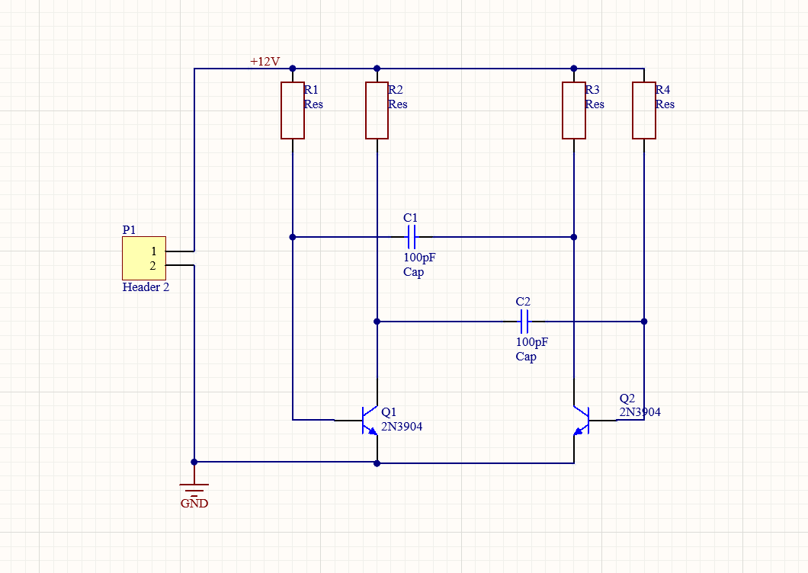
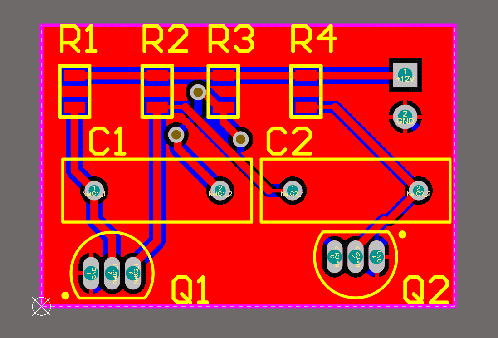
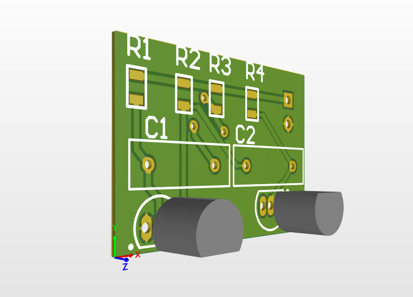

# ⚡️ Проєкт: Мультивібратор на Altium Designer ⚡️

Цей репозиторій присвячений проєкту мультивібратора, повністю розробленого за допомогою потужного програмного забезпечення Altium Designer. Робота виконана в межах університетської практики, демонструючи етапи від принципової схеми до готової друкованої плати.

---

## 👨‍🔬 Про розробника

* Ім'я: Зданевич-Михайловська Варвара
* Група: ЕС-231Б
* Університет: Київський авіаційний інститут (КАІ)
* Дисципліна: Електронні системи

---

## 🎯 Суть Проєкту: Мультивібратор

Мультивібратор — це фундаментальний електронний генератор, що виробляє прямокутні імпульси. У цьому проєкті ми реалізували астабільний мультивібратор, який безперервно генерує імпульси без зовнішнього запуску. Це робить його незамінним у таких застосуваннях, як тактові генератори, модулятори та осцилятори.

Проєкт охоплює:
* Розробку принципової електричної схеми.
* Проєктування друкованої плати (PCB) з оптимальним розміщенням компонентів та трасуванням.
* Створення 3D-моделі плати для візуалізації кінцевого продукту.

---

## 🛠 Використані Технології

* Altium Designer – флагманський інструмент для автоматизованого проєктування електроніки, що забезпечив повний цикл розробки від ідеї до готових файлів виробництва.

---

## 🖼 Галерея Проєкту: Візуалізація Роботи

Ознайомтеся з ключовими візуальними етапами розробки мультивібратора:

### Принципова Схема 🧩

*Опис: Детальна принципова схема мультивібратора, основа всього проєкту.*

### Розробка Друкованої Плати (PCB Layout) 🛣

*Опис: Вид друкованої плати з розміщеними компонентами та ретельно прокладеними електричними зв'язками.*

### 3D-Модель Плати 🌐

*Опис: Тривимірний вигляд готової друкованої плати, що дозволяє оцінити її фізичні параметри та компоновку.*

---

## 🗂 Структура Репозиторію

Ось як організовані файли в цьому репозиторії:

<pre><code>
.
├── images/                 # Містить скріншоти та візуалізації проєкту
│   ├── schematic.png       
│   ├── pcb_layout.png      
│   └── 3d_view.png         
├── Practica/               # Основна папка з файлами проєкту Altium Designer
│   ├── Practica.PrjPcb     # Головний файл проєкту Altium
│   ├── Sheet1.SchDoc       # Файл принципової схеми
│   └── PCB1.PcbDoc         # Файл друкованої плати
├── .gitignore              # Налаштування для Git, що виключають непотрібні файли
├── mydoc.txt               # Додатковий текстовий документ (для ознайомлення з Git)
└── README.md               # Цей документ, який ви зараз читаєте
</code></pre>

---